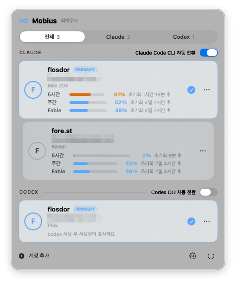

# Mobius

[한국어](README.md) | **English**

**Stop juggling Claude and Codex accounts. Let them flow.**

Using Claude or Codex with multiple subscription accounts? Hit the limit, log out,
log into another account, come back when it resets… Mobius removes that loop.

- **Switch accounts with one click** — no re-login, takes effect instantly.
- **Auto-switch when you hit a limit** — your workflow never stops.
- **Auto-return when the limit resets** — nothing to keep track of.

Primary → fallback → back to primary. An endless Möbius strip — hence the name.

<p align="center">
  
</p>

Click the ∞ icon in the menu bar to open this panel. Each account shows its
**5-hour/weekly usage gauges** and **time until reset**; click a card to switch.

## Is this for you?

- You alternate between a personal Claude Max account and a work account
- You only notice an exhausted limit after the warning interrupts you
- You use both the terminal (Claude Code CLI) and the Claude Desktop app

> **Supported**: Claude Code CLI switching for claude.ai subscription accounts
> (personal Max, work Team/Enterprise), and OpenAI **Codex CLI** switching
> (ChatGPT subscription login) — the two providers run as independent pools, each with
> its own auto-switch and auto-return. Claude Desktop co-switching is included as experimental.
> **Not supported**: Console/OpenAI API keys / Bedrock / Vertex.
> **Requirements**: macOS 14+ and the CLI of each provider you switch (`claude` / `codex`).

## Install

### 1. Download

Grab the latest `Mobius-x.y.z.dmg` from the
[**Releases page**](https://github.com/chussum/mobius/releases/latest).

### 2. Install

Open the DMG and **drag Mobius into the Applications folder**. Done.

### 3. First launch

Just **double-click Mobius** in Applications and it opens right away. Release builds are
signed with an Apple **Developer ID** and **notarized**, so there's no "unidentified
developer" warning.

<details>
<summary>If you built from source and see a warning</summary>

<br>

Unsigned/self-signed builds (not notarized) may show *"'Mobius' can't be opened because it
is from an unidentified developer"* on first launch. Just do this **once**: right-click the
app → **Open**, or go to **System Settings → Privacy & Security** and click **"Open Anyway"**.

<p align="center">
  
</p>
</details>

Once running, Mobius lives in the **menu bar as an ∞ icon** — no Dock icon. Closing
the window doesn't quit it; it keeps watching. Enable "Launch at login" in Settings
for extra convenience.

> **Developers**: build from source with
> `Scripts/make-app.sh && open dist/Mobius.app`
> (run `Scripts/setup-signing.sh` once for a stable signing certificate).
> Install the `mobius` CLI via app **Settings → General → mobius CLI → Install** or `Scripts/install-cli.sh`.
> For release signing, notarization & distribution, see [docs/RELEASING.md](docs/RELEASING.md).

## Getting started

1. Menu bar ∞ icon → Settings (⚙) → **Installed Tools → Add Account**
2. Sign in with the Claude account you want to add — that's it!

The login window always opens in a clean session, so it never auto-approves against
your browser's existing claude.ai session and never touches your browser. When login
completes, Mobius detects it, registers the account, and restores whichever account
you were using. Signing in with an already-registered account refreshes its tokens
instead of creating a duplicate.

### Everyday use

- **Switch**: click an account card. No re-login; on failure it rolls back automatically.
- **Set priorities**: the top card is primary; the rest are fallbacks.
  Drag fallback cards to reorder — that order is the auto-switch order.
  To promote a fallback, right-click the card (or ⋯ menu) → **"Set as primary account"**.
- **Menu bar icon color**: default (primary active) · amber (fallback active) · red (all exhausted).
  Every switch fires a macOS notification.

### Settings toggles

All in Settings (⚙). **Auto-switch** is a per-CLI toggle under Installed Tools
(Claude Code CLI / Codex CLI each); the two Claude Desktop toggles live in the
**Labs** (실험실) section.

| Toggle | Section | Default | What it does |
|---|---|---|---|
| Auto-switch (per CLI) | Installed Tools | On | Auto-switch when a limit is hit. Off = notification only; manual switching always works |
| Also switch Claude Desktop on auto-switch | Labs | Off | Also switch Claude Desktop on auto-switch (Desktop restarts at that moment) |
| Also switch Claude Desktop on account switch | Labs | Off | Co-switch Desktop on card-click switches. Works only for accounts connected to Desktop |

### Using Claude Desktop too

Press **⋯ → "Connect Claude Desktop"** on an account card, then follow the guide:
① Desktop opens ② sign in with that account ③ it's saved automatically.
Once connected, switching accounts also switches Desktop (2–5s restart).

### Continue on any Mac (Labs)

Turn on **Settings → Labs → Sync with other Macs** to share conversation history, plans,
skills, global memory (CLAUDE.md), and your plugin list across Macs via iCloud Drive,
Google Drive, or any folder you pick. Continue conversations anywhere — and what Claude
learns on one Mac, it knows on all of them.

- **Your logins never move** — credentials, the account list, and secret tokens are never
  synced (blocked at the code level, guaranteed by tests).
- Only items you turn on on a given Mac take part; a Mac with sync off is untouched.
- Deletion is your choice: "keep on other Macs" (default) or "delete on other Macs too"
  (moved to a trash folder and kept 30 days — never wiped instantly).
- Projects inside your home folder continue across Macs even when usernames differ
  (home paths are remapped automatically during sync). Paths outside home must match.

## Terminal usage (optional)

The app covers everything, but if you prefer the terminal, the `mobius` command is
available (app **Settings → General → mobius CLI → Install**):

```
mobius list                        # account list per provider (active ●, priority, limit status)
mobius switch <name>               # switch by nickname (--provider claude|codex if ambiguous)
mobius status                      # active account per provider, time until reset
mobius capture <name>              # register the currently logged-in claude account
mobius capture <name> --provider codex   # register the currently logged-in codex account
mobius auto on|off                 # toggle auto-switch (--provider claude|codex, both if omitted)
```

CLI switches reflect instantly in the running app.
Note: Desktop co-switching only applies to switches made in the app — `mobius switch`
changes CLI credentials only.

## How auto-switching works

**Limit detection never touches the network** — it reads local session logs only, so
there's no account risk from unusual traffic. Mobius's only server calls are the usage
gauges (fetched when you open the popover, 4-minute cache), sign-in, and a once-a-day
update check (GitHub, can be turned off in Settings); disable the gauges and update
check and background network use drops to zero.

1. **Detect**: every 15 seconds it scans only the new lines of session logs
   (the first scan records offsets only — no false positives from old events).
   For Claude it parses reset times from rate-limit events in
   `~/.claude/projects/**/*.jsonl`, excluding events containing `not your usage limit` —
   measurements show 69% of rate-limit events are server-side limits, not account limits.
   For Codex it reads the structured usage (rate_limits) carried in every turn of
   `~/.codex/sessions/**/*.jsonl` — usage gauges come from the same source, so Codex
   involves no server requests at all.
2. **Switch**: when the active account is exhausted, switch to the next available
   account by priority. If none is available, you just get an "all accounts exhausted"
   notification.
3. **Return**: primary's reset time + a 60s margin passes → automatically return.
   No server polling.
4. **Anti-flapping**: a 120s cooldown after each switch prevents chain switches
   (B→C→D) caused by stale logs from the previous session.
5. Events without a reset time (e.g. monthly spend limits) are treated conservatively
   as resetting after 24 hours.

Usage gauges are fetched only when the popover opens (4-minute cache) — never polled.

## Good to know

- **Adding a Codex account**: in a terminal, run `codex logout` then `codex login`
  with the account you want to add — Mobius registers it automatically within seconds
  (your current account is already saved as a card, so you can switch back anytime).
  Codex has no automatic "sign in again" detection yet.
- **If a Codex switch reverts on its own**: a still-running codex session from the
  previous account can write its refreshed tokens back, flipping the login (Mobius
  notifies you when this happens). To make a switch stick, close the previous
  account's running codex sessions.
- **Running `claude` sessions**: switching does **not** interrupt running sessions
  (measured through many switch round-trips). However, an already-running session
  keeps using the previous account's credentials — start a new session to use the
  new account.
- **Re-login detection**: accounts with revoked tokens are flagged automatically
  (via the existing usage check — no extra requests) and show a **"Sign in again"**
  button on the card. Auto-switch skips flagged accounts.
- **Brief mis-display after switching**: stale logs from the previous session may
  briefly show a wrong reset countdown on the new account's card (self-resolves).
- **Claude Desktop**:
  - No hot-swap — switching requires a Desktop restart (automated, 2–5s flicker).
  - If web session cookies expire (weeks), reconnect that account after signing
    into Desktop again.
  - It relies on undocumented storage, so a Desktop update may break it. CLI
    switching keeps working regardless; Desktop switch failures are reported via
    notification.
- **If keychain permission dialogs appear**: the keychain item's partition list may
  have been tainted (e.g. by older versions). Run once in a terminal (keychain
  password required):
  ```bash
  security set-generic-password-partition-list -S "apple-tool:,apple:" -s "Claude Code-credentials" -a $USER
  ```
  After that, Mobius keeps the item compatible automatically.

## Security

- **Secrets never leave your machine.** Per-account OAuth token snapshots are stored
  in `~/Library/Application Support/Mobius/secrets/` with **owner-only permissions
  (0600)** — the same protection level Claude Code itself uses for its tokens.
- Switching only writes to the locations Claude Code already uses (Keychain
  `Claude Code-credentials`, `~/.claude/.credentials.json`, and `oauthAccount` in
  `~/.claude.json`). Keychain reads/writes go through the standard macOS `security`
  tool to stay compatible with the claude ecosystem.
- Desktop snapshots live in `~/Library/Application Support/Mobius/desktop-profiles/`
  with 0700 permissions. Cookies are already encrypted with a Keychain-held key at
  the source, so no plaintext tokens are stored.
- Deleting an account also deletes its secret snapshot and Desktop snapshot.

## License

Released under the MIT License — see [`LICENSE`](LICENSE) for the full text.

The only external dependency, [swift-argument-parser](https://github.com/apple/swift-argument-parser) (Apple, Apache License 2.0), is credited in [`THIRD-PARTY-NOTICES.md`](THIRD-PARTY-NOTICES.md).

> This is an open-source personal project and is **not affiliated with Anthropic.**
> "Claude" and "Anthropic" are trademarks of Anthropic PBC and are used here only
> descriptively to refer to the products Mobius interoperates with.
